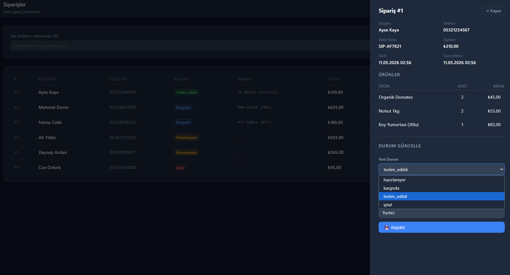
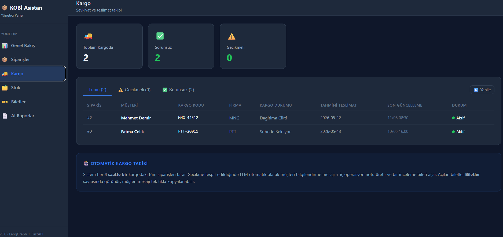
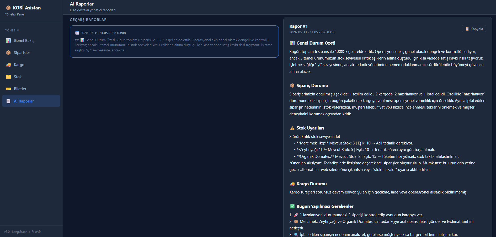
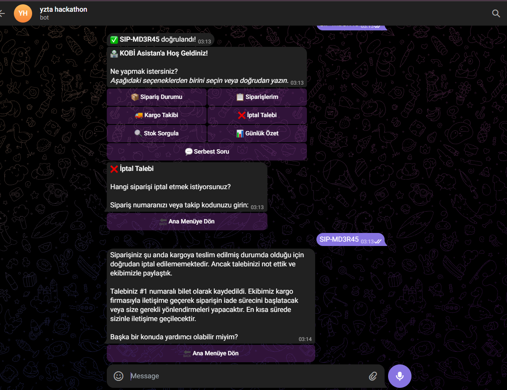
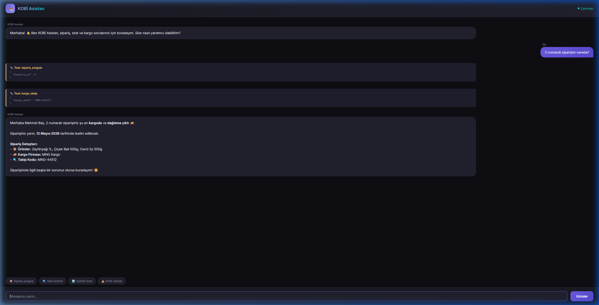
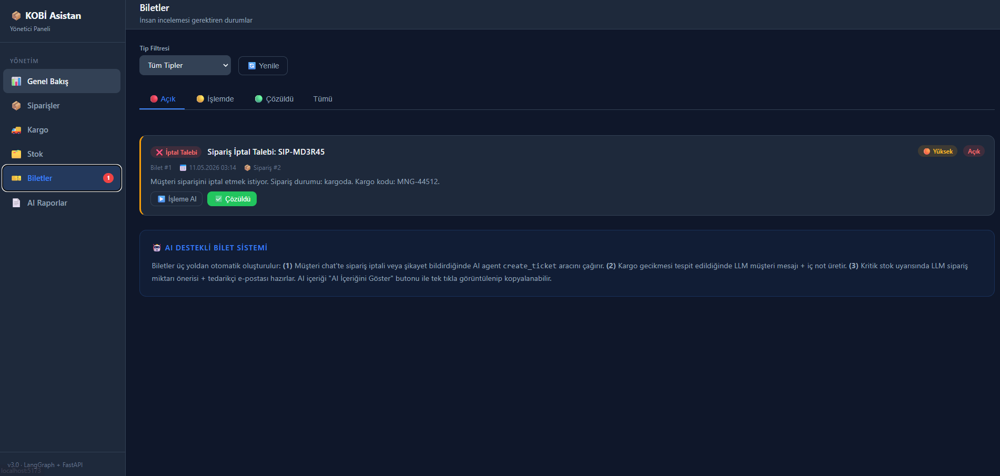

# KOBİ Asistan — AI-Powered SME Operations Platform

> **v4.0** · LangGraph + FastAPI + React Dashboard + Telegram Bot  
> Küçük işletmeler için sipariş, stok ve kargo yönetimini otomatize eden, gerçek maliyetle tasarlanmış AI asistan.

---

## Ekran Görüntüleri

### Genel Bakış (Overview)


### Sipariş Yönetimi



### Kargo Takibi


### Stok & Envanter


### İnsan İncelemesi — Biletler


### AI Günlük Rapor



### Telegram Bot



### Web Chat + Telegram'dan Oluşan Bilet



---

## Mimari

```
Müşteri (Telegram / Web Chat)
        │
        ▼
  ┌─────────────────────────────────────────────────┐
  │  3-Layer Prompt Police (regex, sıfır gecikme)   │
  └──────────────────────┬──────────────────────────┘
                         │ güvenli
                         ▼
  ┌─────────────────────────────────────────────────┐
  │  Auth Middleware (contextvars scope)             │
  │  telefon / SIP-XXXXXX doğrulama                 │
  └──────────────────────┬──────────────────────────┘
                         │
               ┌─────────┴─────────┐
               │ Intent Classifier │  ← %70-80 sorgu LLM'siz
               │ (regex + cache)   │     ~100ms, sıfır maliyet
               └────────┬──────────┘
           ┌────────────┴─────────────┐
    bypass │                          │ LLM gerekli
           ▼                          ▼
  ┌──────────────────┐    ┌──────────────────────────────────┐
  │ Direkt Tool Call │    │  LangGraph StateGraph (ReAct)     │
  │ + Template yanıt │    │  agent ↔ tools (sipariş/stok/    │
  └──────────────────┘    │  kargo/bilet oluşturma)          │
                          └──────────────────────────────────┘
                                       │
                         ┌─────────────┴──────────────────────┐
                         │  APScheduler (Arka Plan Görevler)  │
                         │  08:00 → Sabah raporu (LLM)        │
                         │  2sa   → Kritik stok + LLM bilet   │
                         │  4sa   → Kargo tarama + template   │
                         └─────────────┬──────────────────────┘
                                       │
                         ┌─────────────▼──────────────────────┐
                         │  React Dashboard (Vite, dark)      │
                         │  30s otomatik yenileme             │
                         └────────────────────────────────────┘
```

### LLM Maliyet Optimizasyonu

| Senaryo | LLM | Yöntem |
|---|---|---|
| Basit sorgu (sipariş, stok, kargo) | Hayır | Intent Classifier → Direkt Tool |
| Kargo gecikme müşteri mesajı | Hayır | Template (sıfır maliyet) |
| Müşteri iptal / şikayet talebi | Evet | LangGraph ReAct + create_ticket |
| Kritik stok → tedarikçi emaili | Evet | LLM (düşük frekans, yüksek değer) |
| Sabah raporu + açık biletler | Evet | Scheduled, günde bir kez |
| On-demand rapor | Evet | Dashboard butonu |

---

## Özellikler

### Müşteri Tarafı
- **Telegram Bot** — İnteraktif InlineKeyboard menüsü, state machine (6 durum), rate limiting (10/dk, 40/sa)
- **Web Chat API** — SSE stream desteği, session tabanlı
- **Auth** — Telefon (05XXXXXXXXX) veya takip kodu (SIP-XXXXXX) ile kimlik doğrulama; contextvars ile async-safe scope
- **Prompt Police** — 3 katmanlı regex guardrail (prompt injection, kişisel veri sızıntısı, kötü niyetli içerik)
- **Intent Classifier** — Regex tabanlı, 5 dakika response cache, LLM bypass

### Yönetici Tarafı (Dashboard)
- **Overview** — KPI kartları, sipariş dağılımı, kargo uyarıları, son biletler; 30s otomatik yenileme
- **Orders** — Filtrelenebilir tablo + detay drawer; durum güncelleme + kargo kodu atama
- **Cargo** — Renk kodlu gecikme takibi; "Bilet Aç" tek tıkla
- **Inventory** — Stok progress bar'ları; güncelleme + hareket geçmişi modalı (tab'lı)
- **Tickets** — Human-in-the-loop inceleme; LLM içeriği expand (kargo → müşteri mesajı kopyala; stok → tedarikçi emaili kopyala)
- **Reports** — Markdown AI raporu (açık biletler dahil); on-demand oluşturma + geçmiş

### Otomasyon
- **Sabah Raporu** (08:00) — Tüm KPI'lar + açık biletler dahil LLM analiz, aksiyon listesi
- **Stok Alarmı** (2sa) — Kritik ürün başına günde bir bilet; LLM tedarikçi emaili
- **Kargo Gecikmesi** (4sa) — Sipariş başına günde bir bilet; template müşteri mesajı (LLM maliyetsiz)

---

## Kurulum

```bash
git clone <repo>
cd kobi_asistan
python -m venv venv
source venv/bin/activate  # Windows: venv\Scripts\activate
pip install -r requirements.txt
```

### .env

```env
# LLM (default: ollama)
LLM_PROVIDER=ollama
OLLAMA_MODEL=qwen2.5:7b
OLLAMA_BASE_URL=http://localhost:11434

# Veya OpenAI
# LLM_PROVIDER=openai
# OPENAI_API_KEY=sk-...
# OPENAI_MODEL=gpt-4o-mini

# Veya Anthropic
# LLM_PROVIDER=anthropic
# ANTHROPIC_API_KEY=sk-ant-...
# ANTHROPIC_MODEL=claude-haiku-4-5-20251001

# Veya Gemini
# LLM_PROVIDER=gemini
# GEMINI_API_KEY=...
# GEMINI_MODEL=gemini-1.5-flash

# Telegram (opsiyonel)
TELEGRAM_BOT_TOKEN=
TELEGRAM_ENABLED=false
```

### Backend

```bash
uvicorn main:app --reload --port 8000
```

### Dashboard (geliştirme)

```bash
cd dashboard
npm install
npm run dev
# http://localhost:5173
```

### Dashboard (prodüksiyon)

```bash
cd dashboard
npm run build
# Çıktı → ../static/dashboard/
```

---

## API Endpoints

| Method | Endpoint | Açıklama |
|---|---|---|
| POST | `/api/v1/chat` | Senkron AI yanıt |
| POST | `/api/v1/chat/stream` | SSE stream yanıt |
| GET | `/api/v1/notifications` | Scheduler bildirimleri |
| GET | `/dashboard/stats` | Genel bakış KPI |
| GET | `/dashboard/cargo` | Kargo durumu |
| GET/POST | `/tickets/` | Bilet listesi / oluştur |
| PATCH | `/tickets/{id}/status` | Bilet durum güncelle |
| GET | `/tickets/stats/summary` | Bilet istatistikleri |
| POST | `/reports/generate` | AI rapor oluştur |
| GET | `/reports/` | Rapor listesi |
| GET | `/reports/latest/today` | Bugünkü son rapor |
| GET | `/products/{id}/movements` | Stok hareket geçmişi |
| PATCH | `/products/{id}/stock` | Stok güncelle |

---

## Proje Yapısı

```
kobi_asistan/
├── main.py                     # FastAPI app, lifespan
├── config.py                   # Pydantic settings, multi-provider LLM
├── agent/
│   ├── graph.py                # LangGraph StateGraph
│   ├── auth.py                 # contextvars session scoping
│   ├── guard.py                # Prompt Police
│   ├── intent_classifier.py   # Regex classifier + response cache
│   ├── llm_service.py         # LLM factory + rapor/bilet üretimi
│   ├── prompt.py              # System prompt
│   └── scheduler.py           # APScheduler görevleri
├── tools/
│   ├── order_product_tools.py # Sipariş, stok, bilet tools
│   └── kargo_tools.py         # Kargo takip tools
├── routers/
│   ├── chat.py                # /api/v1/chat + stream
│   ├── dashboard.py           # /dashboard/ endpoints
│   ├── tickets.py             # /tickets/ CRUD
│   ├── reports.py             # /reports/ + AI generation
│   ├── orders.py              # /orders/ CRUD
│   └── products.py            # /products/ CRUD + movements
├── database/
│   ├── db.py                  # SQLite init (7 tablo)
│   ├── schemas.py             # Pydantic modeller
│   └── seed.py                # Demo veri
├── integrations/
│   └── telegram_bot.py        # PTB bot, state machine
├── dashboard/                  # React + Vite
│   └── src/
│       ├── pages/             # 6 sayfa
│       ├── components/        # Layout, KPICard, StatusBadge
│       └── api.js             # API sarmalayıcılar
└── docs/
    ├── screenshots/
    ├── revive.md              # AI ajans onboarding
    └── grok_report.txt
```

---

## Veritabanı Tabloları

| Tablo | Açıklama |
|---|---|
| `products` | Ürünler (tenant_id hazır) |
| `orders` | Siparişler (tenant_id hazır) |
| `order_items` | Sipariş kalemleri |
| `cargo_tracking` | Kargo kayıtları |
| `tickets` | Human-in-the-loop biletleri (llm_content JSON, tenant_id hazır) |
| `daily_reports` | LLM sabah raporları |
| `stock_movements` | Stok hareket logu (delta, önce/sonra) |

---

## Öncelik Sırasına Göre Sonraki Hedefler

### 🔴 Yüksek Öncelik

1. **Auth Güçlendirme — Sipariş İptal OTP Doğrulaması**  
   Şu anki auth telefon/takip kodu eşleşmesiyle çalışıyor. İptal gibi geri dönüşü olmayan aksiyonlar için ek doğrulama gerekli:
   - Telegram üzerinden doğrulama kodu (siparişteki kayıtlı numaraya bot mesajı)
   - SMS OTP (Twilio / Netgsm)
   - E-posta doğrulama bağlantısı
   - Yalnızca OTP eşleşmesinden sonra iptal ticket'ı oluşturulsun

2. **Ticket → Anlık Yönetici Bildirimi**  
   Kritik bilet açıldığında Telegram yönetici chat'ine bildirim gönder; şu an biletler sadece dashboard'da görünüyor.

3. **Sipariş Tamamlanınca Stok Düşürmesi**  
   Agent sipariş tamamladığında `stock_movements` tablosuna otomatik log.

### 🟡 Orta Öncelik

4. **Analitik & Grafik Sayfası** (Task 6)  
   Satış trendi, ürün performansı, haftalık LLM içgörüsü; Recharts ile.

5. **FAQ / RAG**  
   "İade koşulları nedir?" gibi tekrarlayan sorular için ChromaDB + statik fallback.

6. **Tedarikçi Email Gönderimi**  
   Stok biletindeki email taslağını yönetici onayladıktan sonra gerçekten SMTP ile gönder.

7. **Rapor Export**  
   PDF / Excel (WeasyPrint / openpyxl).

### 🟢 Uzun Vadeli

8. **WhatsApp Business API**  
   Telegram'a ek müşteri kanalı. Açılan bilet, ilgili müşterinin WhatsApp sohbetine mesaj atmalı — Human-in-the-loop takibi WhatsApp thread'inde yürüsün.

9. **Multi-Tenant**  
   Tüm kritik tablolarda `tenant_id DEFAULT 1` hazır. Gerçek multi-tenant:
   - YAML/DB bazlı tenant config
   - Row-level security veya ayrı şema

10. **vLLM / Faster Inference**  
    Lokal deployment için Ollama yerine vLLM (batched, düşük gecikme).

11. **NeMo Guardrails (Output Rails)**  
    Input zaten regex ile korunuyor. Gelecekte LLM çıktısı için output rails — şu an 500ms overhead nedeniyle ertelendi.

---

## Teknoloji Yığını

| Katman | Teknoloji |
|---|---|
| Backend | FastAPI + Uvicorn |
| AI Framework | LangGraph (StateGraph, ToolNode) |
| LLM | Ollama (lokal) / OpenAI / Anthropic / Gemini |
| Veritabanı | SQLite (kobi.db) |
| Zamanlayıcı | APScheduler (AsyncIOScheduler) |
| Telegram | python-telegram-bot v21 |
| Frontend | React 18 + Vite + react-router-dom v6 |
| Auth | contextvars (async-safe) |
| Güvenlik | Regex Prompt Police (3 katman) |
