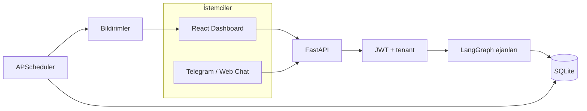

# KOBİ Asistan

<p align="center">
  <b>YZTA Hackathon</b> — KOBİ operasyonları için kiracı-bilinçli, AI destekli yönetim platformu
</p>

<p align="center">
  <a href="https://fastapi.tiangolo.com/" title="FastAPI"></a>
  &nbsp;
  <a href="https://github.com/langchain-ai/langgraph" title="LangGraph"></a>
  &nbsp;
  <a href="https://www.sqlite.org/" title="SQLite"></a>
  &nbsp;
  <a href="https://react.dev/" title="React"></a>
  &nbsp;
  <a href="https://vitejs.dev/" title="Vite"></a>
  &nbsp;
  <a href="https://core.telegram.org/bots/api" title="Telegram Bot API"></a>
  &nbsp;
  <a href="https://apscheduler.readthedocs.io/" title="APScheduler"></a>
</p>

---

## Bu proje ne yapar?

KOBİ Asistan; **sipariş**, **stok**, **kargo**, **raporlama** ve **insan onayı gereken müdahale kayıtlarını** tek çatı altında toplar. Amaç, işletmeciyi tablo yığınına boğmak değil; önce **bugün neye müdahale etmeniz gerektiğini** sade bir akışla göstermek, ardından isterseniz **doğal dille** veya **klasik panellerle** derine inmektir.

## Ekran görüntüleri

### 1. Hoş geldin ekranı


### 2. Günün özeti

Bugünkü satış, kaç sipariş geldi, kaç paket hazırlanacak, kaç “acil sinyal” var hepsi bu ekranda gösterilir. Altında son günlerin cirosunu gösteren çizgi grafik bulunur. Yan tarafta ise **AI brifingi**: bugünü iki üç cümleyle özetleyen metin var isterseniz raporlar sayfasına linkten gidebilir ve daha detaylı bir rapor oluşturabilirsiniz.


### 3. Düşük stok ve bugünkü iptaller

Bir sonraki bölüme ilerleyince **hangi ürünler kritik** ve **bugün iptal olan siparişler** listelenir; stoka veya siparişlere geçmek için ekrandaki bağlantıları kullanılır.


### 4. Hazırlık kuyruğu ve geciken kargolar

Bir sonraki bölümde yan yana **kargoya henüz verilmemiş** siparişler ile **geciken** kargolar gösterilir; paketlenecek kargolar ile müşteriye haber verilmesi gereken kargolar aynı ekranda toplanır.


### 5. AI aksiyonları

Kritik stok, açık müdahale kayıtları, bekleyen siparişler ve kargo gecikmeleri dört kutuda özetlenir; her birinde **İncele** veya **Ertele** kullanılabilir, alttaki bağlantılarla **AI Asistan** veya **Müdahale** sayfasına geçilebilir.


### 6. AI Asistan — soru sorma

Sol bölümde kritik stok, bekleyen sipariş, günlük özet ve açık müdahale için hazır hızlı sorgular bulunur; sağ bölümde doğal dil kullanılarak metinle soru yazılır. Stok veya siparişi değiştirecek işlemlerde önce özet çıkar, **Onayla** denmeden kayıt güncellenmez. Örnekte kritik stoktaki ürünler sorulmuş; cevap ürün listesi ve uyarı kutusuyla birlikte gelir.


### 7. AI Asistan — onay öncesi

*"Nohut stoğunu 10 adet yap"* gibi bir istekte önce yapılacak değişiklik metin olarak gösterilir, ardından **Onayla** düğmeli kart açılır; böylece yanlışlıkla stok değişimi engellenir.


### 8. AI Asistan — onay sonrası

Onaydan sonra sohbette güncelleme mesajı ve yeşil **işlem tamam** özeti görünür; stok değişikliğinin uygulandığı bu ekrandan doğrulanır.


### 9. Stoklar

Ürünler tabloda listelenir: üstte arama bölümü bulunur, **Tümü / Kritik / Yeterli** sekmeleri arasında geçiş yaparak filtreme yapılır. Tablodan veriler istendildiği gibi güncellenir.


### 10. Siparişler

Siparişler tabloda listelenir: üstte arama bölümü bulunur, **Tümü / Hazırlanıyor / Kargoda / Teslim / İptal** sekmeleri arasında geçiş yaparak filtreme yapılır. Tablodan veriler istendildiği gibi güncellenir; **Detay** ile tek sipariş teki ürünler gösterilir.


### 11. Kargolar

Kargodaki siparişler tabloda listelenir: üstte arama bölümü bulunur, **Tümü / Gecikmeli / Sorunsuz** sekmeleri arasında geçiş yaparak filtreme yapılır. **Yeni kargo** ile kayıt eklenebilir; tablodan veriler istendildiği gibi güncellenir, kargo iade olduğunda stok iadesi yapılır.


### 12. Raporlar

Solda geçmiş günler listelenir; seçilen tarihin **AI ile üretilmiş günlük özeti** sağda okunur, metin **Kopyala** ile panoya alınabilir. Sabahları otomatik rapor üretilir. Eğer istenirse **Rapor oluştur** ile anlık olarak da oluşturulabilir.


### 13. Müdahale edilmesi gerekenler

Stok kritik durumdayken, kargo gecikmesi olduğunda ve müşterinin siparişi iptal edilmesi gibi durumlarda bu bölüme kayıt oluşturulur; **İşleme al**, **Çözüldü** ve gerektiğinde **Yeniden aç** ile durum takibi yapılır. 

Müşteri **Telegram** üzerinden ürün listesine bakar, sepete ürün ekler ve siparişi tamamlamak için telefon numarasını ve adını girer; bot sipariş numarası verir ve siparişin **işletme sahibi panelden onaylanana kadar** kesinleşmediğini bildirir. Bu talep **Müdahale** ekranına düşer; KOBİ **Siparişi onayla** dediğinde sipariş oluşturulur ve stok düşer, **Reddet** seçilirse müşteriye Telegram üzerinden bilgi gider.

İptal talebinde müşteri önce **sipariş numarasını** yazar; ardından güvenlik için bottan istenen **siparişte kayıtlı ad soyad** ile **kayıtlı cep telefonu** ayrı ayrı ve sipariş kaydıyla **birebir aynı** girilmelidir. Telefon veya isim siparişle eşleşmezse iptal talebi oluşturulmaz. Bu adımlardan sonra talep **Müdahale** kaydına düşer; KOBİ panelden **iptali onaylamadan** sipariş iptal edilmez ve stok değişmez. Onaylandığında sipariş iptal edilir ve **stoklar iade edilerek yeniden artırılır**.

**Telegram üzerinden sipariş akışı**


**Panelden Telegram siparişinin onaylanması**


---

## Mimari (özet)



---

## Hızlı başlangıç

**Gereksinimler:** Python 3.10+, Node.js 18+, isteğe bağlı Ollama veya bulut LLM anahtarı.

**Backend** (depo kökü):

```bash
python -m venv venv
source venv/bin/activate
pip install -r requirements.txt
python database/seed.py
python database/seed_users.py
uvicorn main:app --reload --port 8000
```

**Dashboard:**

```bash
cd dashboard && npm install && npm run dev
```

| Adres | Açıklama |
|--------|----------|
| http://localhost:5173 | Yönetici paneli |
| http://localhost:8000/docs | OpenAPI |
| http://localhost:8000/static/index.html | Basit web sohbet demosu |

**Demo giriş** (seed sonrası): kullanıcı `admin`, şifre `admin123`.

---

## Ortam değişkenleri

`.env.example` dosyasını `.env` olarak kopyalayın. Özet:

- `LLM_PROVIDER`, `OLLAMA_*` veya OpenAI / Anthropic / Gemini anahtarları  
- `TELEGRAM_ENABLED`, `TELEGRAM_BOT_TOKEN` (isteğe bağlı)  
- JWT: `config.py` içinde `JWT_SECRET`, `JWT_EXPIRE_MINUTES` (üretimde güçlü secret kullanın)
