# KOBİ Asistan

<p align="center">
  <b>YZTA Hackathon</b> — KOBİ operasyonları için kiracı-bilinçli, AI destekli yönetim platformu
</p>

<p align="center">
  <a href="https://fastapi.tiangolo.com/" title="FastAPI"></a>
  &nbsp;
  <a href="https://github.com/langchain-ai/langgraph" title="LangGraph"></a>
  &nbsp;
  <a href="https://www.sqlite.org/" title="SQLite"></a>
  &nbsp;
  <a href="https://react.dev/" title="React"></a>
  &nbsp;
  <a href="https://vitejs.dev/" title="Vite"></a>
  &nbsp;
  <a href="https://core.telegram.org/bots/api" title="Telegram Bot API"></a>
  &nbsp;
  <a href="https://apscheduler.readthedocs.io/" title="APScheduler"></a>
  &nbsp;
  <a href="https://www.docker.com/" title="Docker"></a>
</p>

---

## Bu proje ne yapar?

KOBİ Asistan; **sipariş**, **stok**, **kargo**, **raporlama** ve **insan onayı gereken müdahale kayıtlarını** tek çatı altında toplar. Amaç, işletmeciyi tablo yığınına boğmak değil; önce **bugün neye müdahale etmeniz gerektiğini** sade bir akışla göstermek, ardından isterseniz **doğal dille** veya **klasik panellerle** derine inmektir.

Uygulama **çok kiracılı** çalışır: her işletme için `tenants/<slug>/config.yaml` ile ajan kişiliği, iş modeli ve özellik bayrakları ayrı ayrı tanımlanabilir. **Telegram müşteri botu** üzerinden ürün listesi, sepet, sipariş ve iptal talepleri yönetilir; giyim ve çiçek gibi iş modellerinde **görsel arama** (katalog görsellerine göre en yakın ürün) ve ürün kayıtlarındaki **beden / ölçü rehberi** ile müşteri sorularına yanıt verilir. Panel tarafında JWT ile giriş, günün özeti, AI asistan, stok/sipariş/kargo ekranları ve raporlar bulunur.

## Ekran görüntüleri

### 1. Hoş geldin ekranı

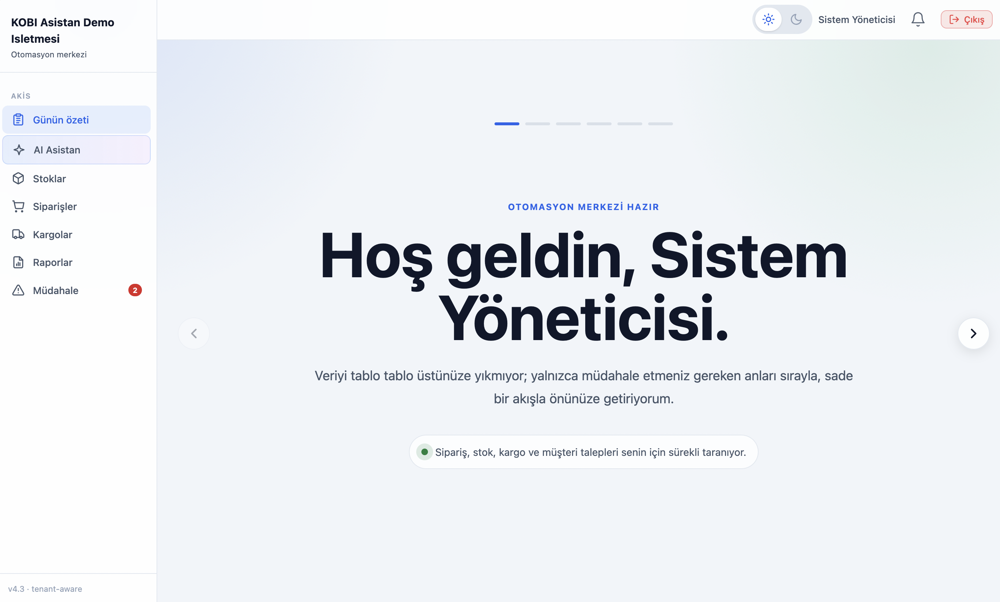

### 2. Günün özeti

Bugünkü satış, kaç sipariş geldi, kaç paket hazırlanacak, kaç “acil sinyal” var hepsi bu ekranda gösterilir. Altında son günlerin cirosunu gösteren çizgi grafik bulunur. Yan tarafta ise **AI brifingi**: bugünü iki üç cümleyle özetleyen metin var isterseniz raporlar sayfasına linkten gidebilir ve daha detaylı bir rapor oluşturabilirsiniz.

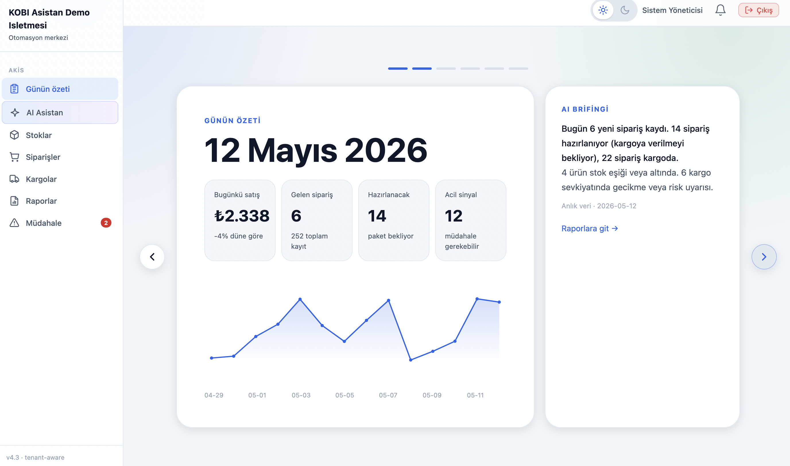

### 3. Düşük stok ve bugünkü iptaller

Bir sonraki bölüme ilerleyince **hangi ürünler kritik** ve **bugün iptal olan siparişler** listelenir; stoka veya siparişlere geçmek için ekrandaki bağlantıları kullanılır.

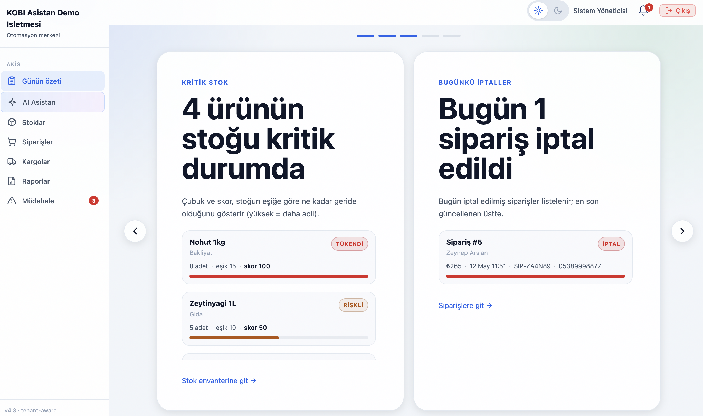

### 4. Hazırlık kuyruğu ve geciken kargolar

Bir sonraki bölümde yan yana **kargoya henüz verilmemiş** siparişler ile **geciken** kargolar gösterilir; paketlenecek kargolar ile müşteriye haber verilmesi gereken kargolar aynı ekranda toplanır.

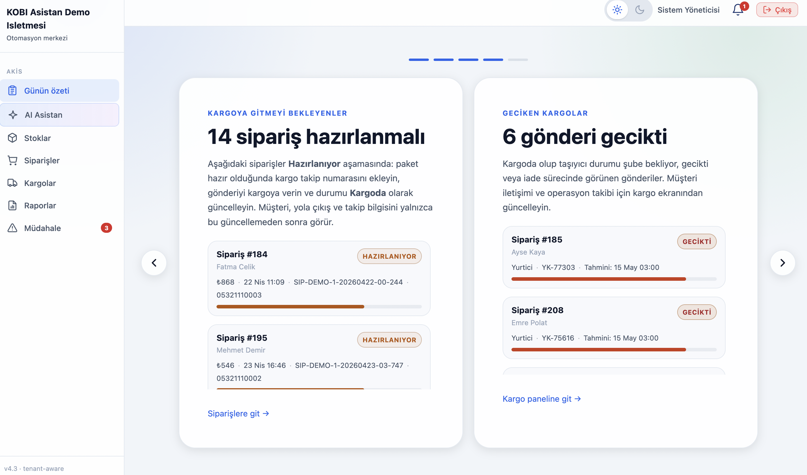

### 5. AI aksiyonları

Kritik stok, açık müdahale kayıtları, bekleyen siparişler ve kargo gecikmeleri dört kutuda özetlenir; her birinde **İncele** veya **Ertele** kullanılabilir, alttaki bağlantılarla **AI Asistan** veya **Müdahale** sayfasına geçilebilir.

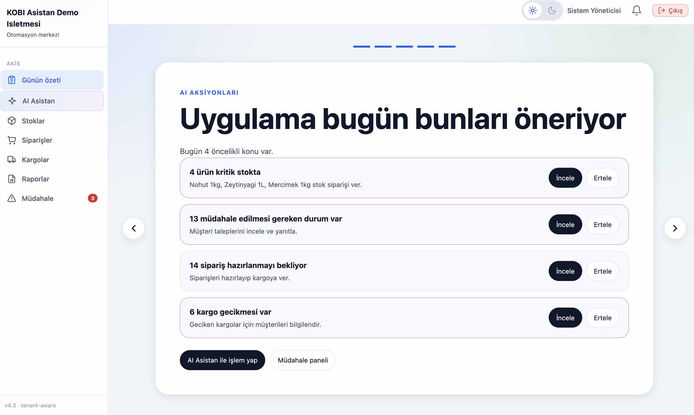

### 6. AI Asistan — soru sorma

Sol bölümde kritik stok, bekleyen sipariş, günlük özet ve açık müdahale için hazır hızlı sorgular bulunur; sağ bölümde doğal dil kullanılarak metinle soru yazılır. Stok veya siparişi değiştirecek işlemlerde önce özet çıkar, **Onayla** denmeden kayıt güncellenmez. Örnekte kritik stoktaki ürünler sorulmuş; cevap ürün listesi ve uyarı kutusuyla birlikte gelir.

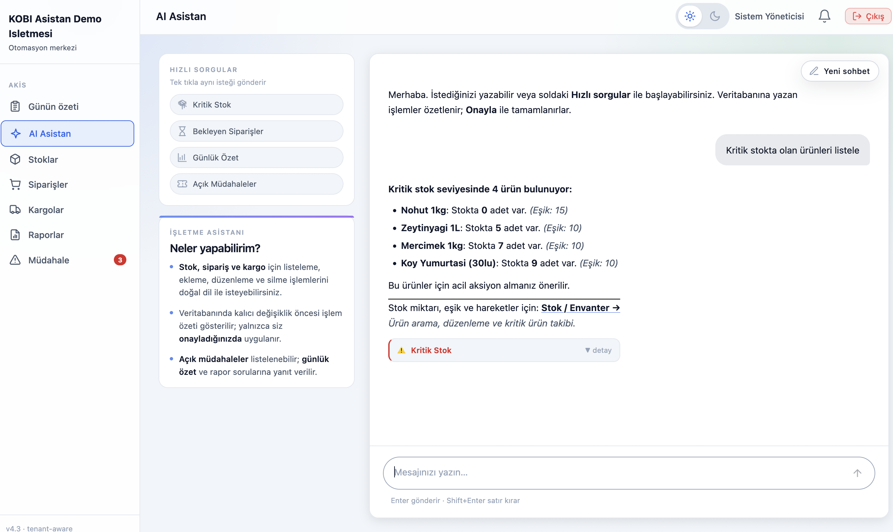

### 7. AI Asistan — onay öncesi

*"Nohut stoğunu 10 adet yap"* gibi bir istekte önce yapılacak değişiklik metin olarak gösterilir, ardından **Onayla** düğmeli kart açılır; böylece yanlışlıkla stok değişimi engellenir.

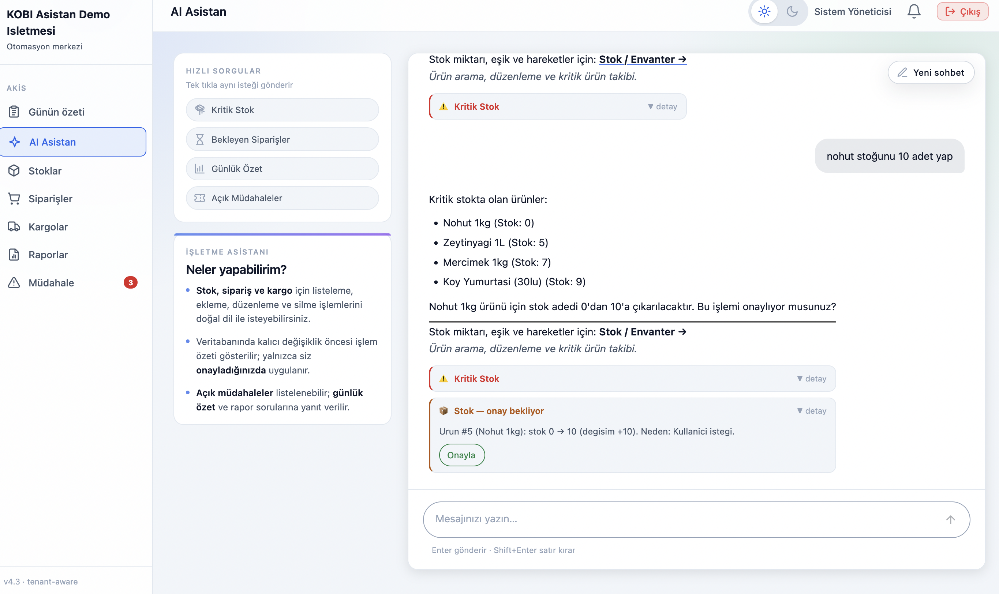

### 8. AI Asistan — onay sonrası

Onaydan sonra sohbette güncelleme mesajı ve yeşil **işlem tamam** özeti görünür; stok değişikliğinin uygulandığı bu ekrandan doğrulanır.

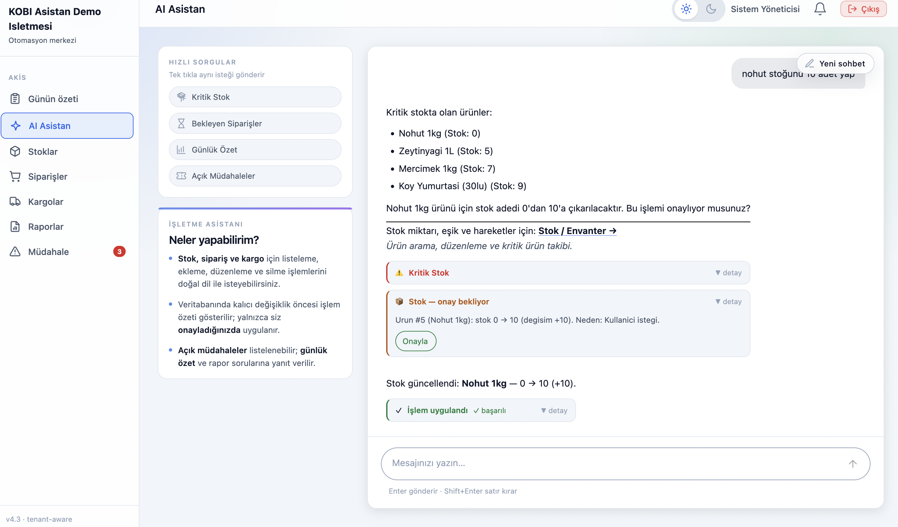

### 9. Stoklar

Ürünler tabloda listelenir: üstte arama bölümü bulunur, **Tümü / Kritik / Yeterli** sekmeleri arasında geçiş yaparak filtreme yapılır. Tablodan veriler istendildiği gibi güncellenir.

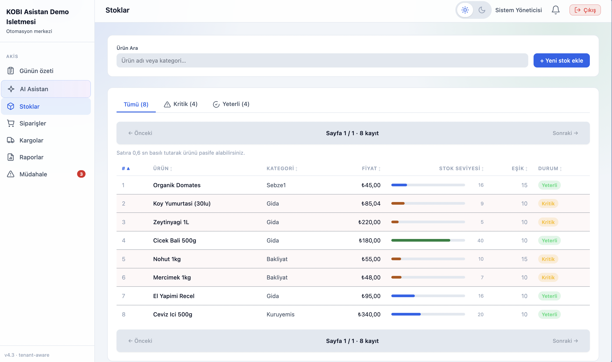

### 10. Siparişler

Siparişler tabloda listelenir: üstte arama bölümü bulunur, **Tümü / Hazırlanıyor / Kargoda / Teslim / İptal** sekmeleri arasında geçiş yaparak filtreme yapılır. Tablodan veriler istendildiği gibi güncellenir; **Detay** ile tek sipariş teki ürünler gösterilir.

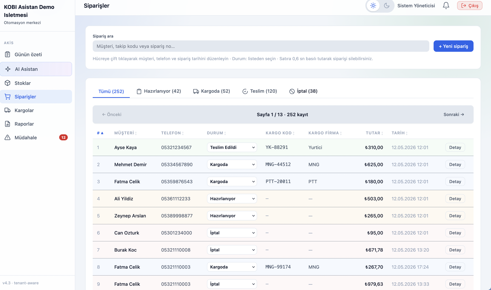

### 11. Kargolar

Kargodaki siparişler tabloda listelenir: üstte arama bölümü bulunur, **Tümü / Gecikmeli / Sorunsuz** sekmeleri arasında geçiş yaparak filtreme yapılır. **Yeni kargo** ile kayıt eklenebilir; tablodan veriler istendildiği gibi güncellenir, kargo iade olduğunda stok iadesi yapılır.

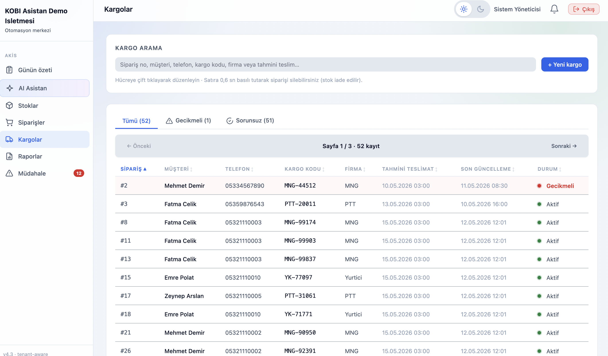

### 12. Raporlar

Solda geçmiş günler listelenir; seçilen tarihin **AI ile üretilmiş günlük özeti** sağda okunur, metin **Kopyala** ile panoya alınabilir. Sabahları otomatik rapor üretilir. Eğer istenirse **Rapor oluştur** ile anlık olarak da oluşturulabilir.

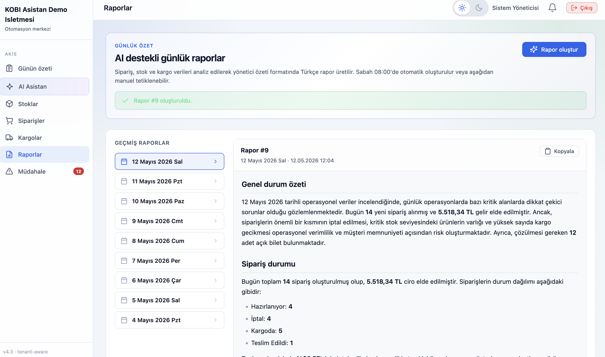

### 13. Müdahale edilmesi gerekenler

Stok kritik durumdayken, kargo gecikmesi olduğunda ve müşterinin siparişi iptal edilmesi gibi durumlarda bu bölüme kayıt oluşturulur; **İşleme al**, **Çözüldü** ve gerektiğinde **Yeniden aç** ile durum takibi yapılır.

Müşteri **Telegram** üzerinden ürün listesine bakar, sepete ürün ekler ve siparişi tamamlamak için telefon numarasını ve adını girer; bot sipariş numarası verir ve siparişin **işletme sahibi panelden onaylanana kadar** kesinleşmediğini bildirir. Bu talep **Müdahale** ekranına düşer; KOBİ **Siparişi onayla** dediğinde sipariş oluşturulur ve stok düşer, **Reddet** seçilirse müşteriye Telegram üzerinden bilgi gider.

İptal talebinde müşteri önce **sipariş numarasını** yazar; ardından güvenlik için bottan istenen **siparişte kayıtlı ad soyad** ile **kayıtlı cep telefonu** ayrı ayrı ve sipariş kaydıyla **birebir aynı** girilmelidir. Telefon veya isim siparişle eşleşmezse iptal talebi oluşturulmaz. Bu adımlardan sonra talep **Müdahale** kaydına düşer; KOBİ panelden **iptali onaylamadan** sipariş iptal edilmez ve stok değişmez. Onaylandığında sipariş iptal edilir ve **stoklar iade edilerek yeniden artırılır**.

**Telegram üzerinden sipariş akışı**

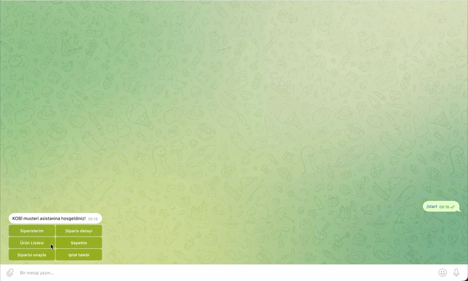

**Panelden Telegram siparişinin onaylanması**

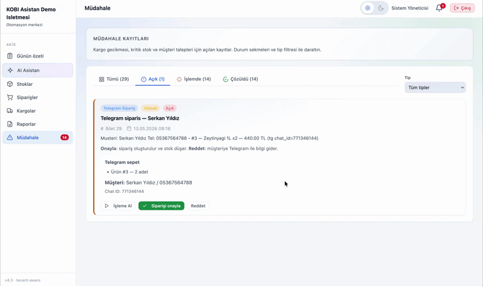

### 14. Telegram — beden bilgisi sorgulama

Müşteri ürün fotoğrafı gönderip boy/kilo gibi bilgilerle uygun bedeni sorabilir; bot görseli katalogda eşleştirir, **beden notu** ve ürün bilgisini döner, sepet ve liste için düğmeler sunar.

.png)

### 15. Telegram — görsel arama

Müşteri bir ürün fotoğrafı gönderip stokta olup olmadığını sorabilir; bot katalog gömülü vektörleriyle en yakın ürünü bulur, fiyat, stok, benzerlik yüzdesi ve beden/ölçü notlarını listeler.

.png)

---

## Mimari

Uygulama tek bir **FastAPI** sürecinde çalışan modüler bir **monolit**tir: HTTP router’lar, arka plan zamanlayıcı ve Telegram botu aynı process yaşam döngüsünde başlar (`main.py` içindeki `lifespan`). Durum **SQLite** dosyasında tutulur; kiracıya özel ajan davranışı `tenants/<slug>/config.yaml` ile yüklenir (`agent/tenant_config.py`).

### Mantıksal katmanlar

| Katman | Görev | Önemli modüller |
|--------|--------|-----------------|
| **Sunum** | Panel, basit web sohbet, Telegram sohbeti | `dashboard/` (React + Vite), `static/index.html`, `integrations/telegram_bot.py` |
| **API / HTTP** | REST uçları, JWT, dosya yükleme, OpenAPI | `routers/*`, `main.py` |
| **Oturum ve güvenlik** | Panelde JWT; müşteri kanalında telefon veya sipariş takip kodu ile kapsül | `routers/auth_router.py`, `agent/auth.py`, `agent/guard.py` |
| **Ajanlar** | Kiracı bilinçli LLM + araç döngüsü (LangGraph) | `agent/graph.py` (müşteri/web), `agent/admin_graph.py` (işletmeci panel asistanı) |
| **Araçlar ve kurallar** | Sipariş, stok, kargo, bilet, OTP iptal, ürün danışmanlığı, görsel arama | `tools/*` |
| **İş servisleri** | Müdahale tetikleyicileri, görsel embedding ve toplu yükleme | `services/stock_intervention.py`, `services/cargo_intervention.py`, `services/order_intervention.py`, `services/visual_stock_ingestion.py` |
| **Veri erişimi** | Kiracı filtresiyle SQL | `repositories/*`, `database/db.py`, `database/schemas.py` |
| **Zamanlayıcı ve bildirim** | Günlük rapor, metrik rollup, stok/kargo biletleri, kuyruk | `agent/scheduler.py`, `integrations/notifier.py` |

### HTTP yüzeyi (özet)

- **`/auth`** — Giriş, JWT üretimi; panel isteklerinde `Authorization: Bearer`.
- **`/dashboard`, `/orders`, `/products`, `/tickets`, `/reports`** — Panel verisi ve işlemler; çoğu uç kiracı (`tenant_id`) ile filtrelenir.
- **`/api/v1/chat`, `/api/v1/chat/stream`** — Genel müşteri sohbeti: niyet sınıflandırma (`agent/intent_classifier.py`), guard, isteğe bağlı telefon/takip kodu kapsülü, ardından **`agent_graph`** LangGraph döngüsü (`agent/graph.py`).
- **`/api/v1/admin/*`** — Panel **AI Asistan**: **`admin_graph`**, stok gibi mutasyonlar için önce özet + kullanıcı onayı, sonra `tools/admin_mutation_apply.py` ile uygulama.
- **`/visual-stock`** — Onboarding / toplu görsel yükleme, aday onayı, görselden arama (CLIP embedding’ler `product_image_embeddings` ile SQLite’ta).
- **`/tenant-setup`** — Yeni işletme kaydı ve yapılandırma akışı.
- **`/static`** — Sohbet demosu ve yüklenen görseller.

Telegram tarafında bir kısmı **doğrudan Python-telegram-bot FSM** ile yürür (sepet, sipariş adımları, iptal, hızlı düğmeler); görsel gönderiminde `services/visual_stock_ingestion.search_by_uploaded_image` çağrılır. Müşteri metinleri isterseniz yine ajan + araçlarla zenginleştirilebilir; mimaride kanal **TelegramAdapter** (`integrations/channels/`) üzerinden soyutlanır.

### Veri ve görsel arama

- **İş verisi:** ürünler, siparişler, kargo, biletler (müdahale), günlük raporlar, kullanıcılar — tek SQLite şeması, satırlarda `tenant_id`.
- **Görsel benzerlik:** ürün görselleri için embedding JSON (`product_image_embeddings`); sorgu anında yüklenen görsel aynı model uzayında kodlanır ve kosinüs benzerliği ile eşleştirilir (iş modeline göre FashionCLIP veya genel CLIP — `config.py` içindeki model adları).

### Zamanlayıcı (APScheduler)

Örnek sorumluluklar: günlük **AI raporu** üretimi ve kayıt, **tenant metrik** rollup, kritik stok veya kargo gecikmesi için **müdahale kaydı** açma, pano bildirim kuyruğuna özet düşme. Böylece panel “bugün ne var?” sorusunu hem canlı isteklerle hem zamanlanmış işlerle doldurur.

### Bileşen diyagramı

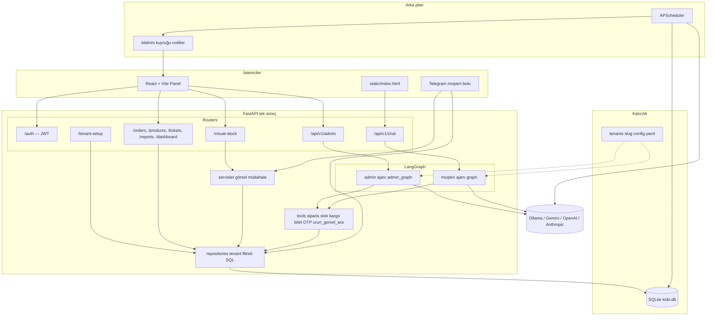

### Tipik istek akışları

1. **Panelde AI Asistan:** İstek JWT ile gelir → `tenant_id` bağlamı set edilir → `admin_graph` LLM’i çağırır → gerekirse araçlar veritabanını okur/yazar → stok değişimi gibi riskli işlemlerde UI **onay** akışı (`pending_admin_mutations`) devreye girer.
2. **Web sohbet / müşteri:** Mesaj guard’dan geçer → (isteğe bağlı) telefon veya `SIP-XXXXXX` ile kapsül → `agent_graph` döngüsü araçlarla sipariş ve stok sorularını yanıtlar.
3. **Telegram görsel:** Fotoğraf alınır → embedding ile en yakın ürün bulunur → metin + satır içi düğmeler (sepet, liste) → sipariş tamamlanınca bilet veya sipariş kaydı panel müdahalesine düşebilir.

---

## Kurulum

### Gereksinimler

| Bileşen | Manuel kurulum | Docker (API) |
|--------|----------------|--------------|
| Python | 3.10 veya üzeri | Görüntüde 3.11 |
| Node.js | 18+ (yalnızca panel) | Panel için ayrıca hostta Node gerekir |
| LLM | Ollama (yerel) veya `.env` ile Gemini / OpenAI / Anthropic | Ollama genelde **hostta** çalışır; konteyner `host.docker.internal` ile erişir |
| Opsiyonel | Görsel arama için `requirements.txt` içindeki CLIP / embedding paketleri (ilk model indirmesi ağır olabilir) | Aynı; ilk `docker compose build` uzun sürebilir |

### Manuel kurulum

1. **Depoyu alın** (klon veya arşiv) ve proje köküne geçin.
2. **Ortam dosyası:** `.env.example` dosyasını `.env` olarak kopyalayın; LLM sağlayıcısı ve isteğe bağlı Telegram alanlarını doldurun (ayrıntılar: [Ortam değişkenleri](#ortam-değişkenleri)).
3. **Yerel LLM (isteğe bağlı):** `LLM_PROVIDER=ollama` kullanacaksanız [Ollama](https://ollama.com/) kurun ve `.env` içindeki `OLLAMA_MODEL` ile uyumlu modeli çekin.
4. **Python sanal ortamı ve bağımlılıklar:**
   ```bash
   python -m venv venv
   source venv/bin/activate
   pip install -r requirements.txt
   ```
5. **Demo çok kiracılı veri (önerilir):** Telegram’da görsel arama, Mina Butik ve diğer demo işletmeler için bir kez çalıştırın. Script, ürün görselleri için embedding üretir; ilk çalıştırma model indirmesi nedeniyle uzun sürebilir.
   ```bash
   python scripts/seed_demo_tenants.py
   ```
6. **Backend:** Uygulama açılışında veritabanı şeması, temel tohum verisi ve `admin` kullanıcısı otomatik oluşturulur; yine de boş veya sıfırdan kurulumda adım 5’i atlamadan önce veya sonra bu komutu kullanabilirsiniz.
   ```bash
   uvicorn main:app --reload --port 8000
   ```
7. **Yönetici paneli:** Ayrı bir terminalde:
   ```bash
   cd dashboard && npm install && npm run dev
   ```
8. **Telegram botu:** `.env` içinde `TELEGRAM_ENABLED=true`, geçerli `TELEGRAM_BOT_TOKEN` ve demo için `TELEGRAM_TENANT_ID=2` (Mina Butik) ayarlayın; bot API ile aynı süreçte başlar.

### Docker kurulumu

1. [Docker](https://docs.docker.com/get-docker/) ve Docker Compose eklentisinin kurulu olduğundan emin olun.
2. Proje kökünde `.env` dosyasını oluşturun (`.env.example` şablonu). Konteyner içinden makinenizde çalışan Ollama’ya erişmek için örnek:
   ```env
   OLLAMA_BASE_URL=http://host.docker.internal:11434
   ```
3. Görüntüyü derleyin ve API’yi başlatın:
   ```bash
   docker compose build
   docker compose up -d
   ```
4. **Demo kiracılar ve görsel arama verisi** için konteyner içinde bir kez:
   ```bash
   docker compose exec api python scripts/seed_demo_tenants.py
   ```
5. **Panel:** Docker yalnızca FastAPI API’sini çalıştırır. Arayüzü geliştirme modunda kullanmak için host makinede:
   ```bash
   cd dashboard && npm install && npm run dev
   ```
   Vite, `vite.config.js` üzerinden `http://localhost:8000` adresindeki API’ye proxy yapar; API portu `8000` olarak yayınlandığı sürece ek ayar gerekmez.

6. Durdurmak için: `docker compose down`

**Notlar**

- `docker-compose.yml` içinde `./database`, `./static` ve `./tenants` klasörleri bağlanır; böylece SQLite veritabanı ve yüklenen dosyalar konteyner dışında kalır.
- Görsel arama için PyTorch ve CLIP ağırlıkları büyüktür; ilk `build` ve ilk `seed_demo_tenants` çalıştırması sabır ister.

---

## Çalıştırma adresleri

| Adres | Açıklama |
|--------|----------|
| http://localhost:5173 | Yönetici paneli (Vite geliştirme sunucusu) |
| http://localhost:8000/docs | OpenAPI (Swagger) |
| http://localhost:8000/static/index.html | Basit web sohbet demosu |

**Demo giriş:** `scripts/seed_demo_tenants.py` çalıştırdıysanız kiracı panelleri için `docs/demo_accounts.md` dosyasındaki hesapları (ör. `mina_butik` / `demo1234`) kullanın. Yalnızca varsayılan tohum ile gelen sistem yöneticisi: kullanıcı `admin`, şifre `admin123`.

---

## Ortam değişkenleri

`.env.example` dosyasını `.env` olarak kopyalayın. Özet:

- **LLM:** `LLM_PROVIDER` (`ollama`, `gemini`, `openai`, `anthropic`), buna göre `OLLAMA_*`, `GEMINI_API_KEY` / `GOOGLE_API_KEY`, `OPENAI_API_KEY`, `ANTHROPIC_API_KEY` ve model adları.
- **Telegram:** `TELEGRAM_ENABLED`, `TELEGRAM_BOT_TOKEN`, `TELEGRAM_TENANT_ID` (müşteri botunun bağlı olduğu kiracı; demo için genelde `2`).
- **JWT:** `JWT_SECRET`, `JWT_ALGORITHM`, `JWT_EXPIRE_MINUTES` — üretimde güçlü bir gizli anahtar kullanın (varsayılanlar yalnızca geliştirme içindir).
- **Görsel stok (isteğe bağlı):** `FASHION_CLIP_MODEL`, `GENERAL_CLIP_MODEL` (`config.py` içinde tanımlı; ağır modeller için ortamı güçlü makineye kurun).

Tam liste ve yorumlar için `config.py` ile `.env.example` birlikte okunmalıdır.
