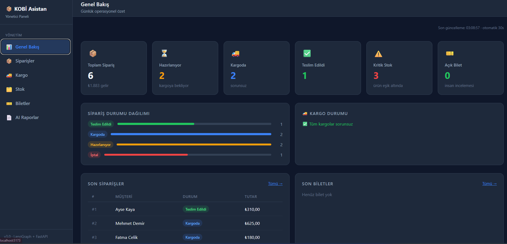
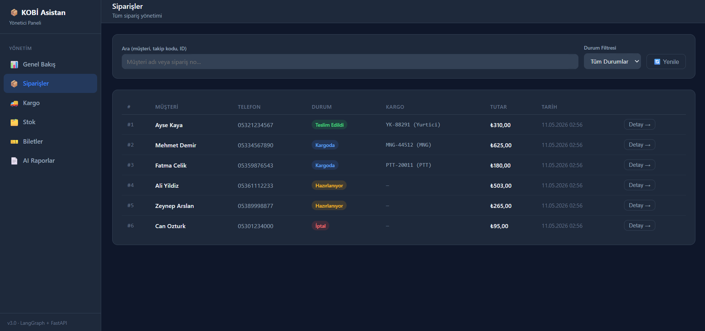
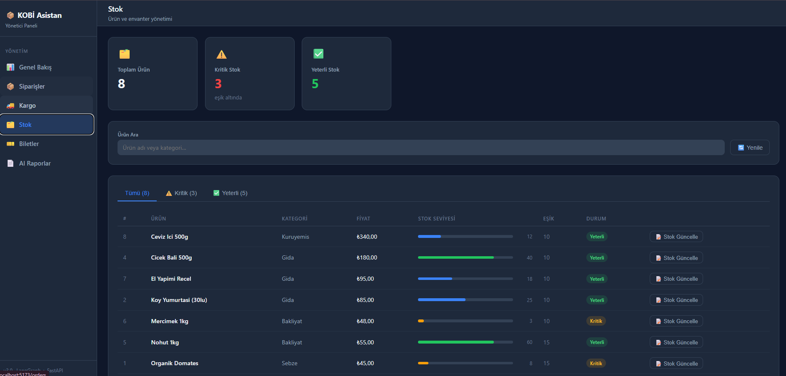
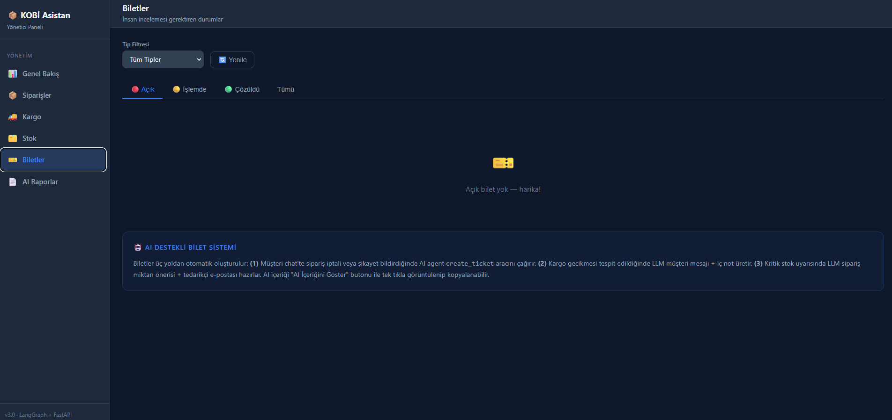
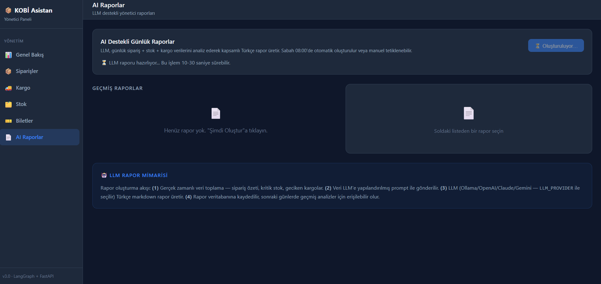
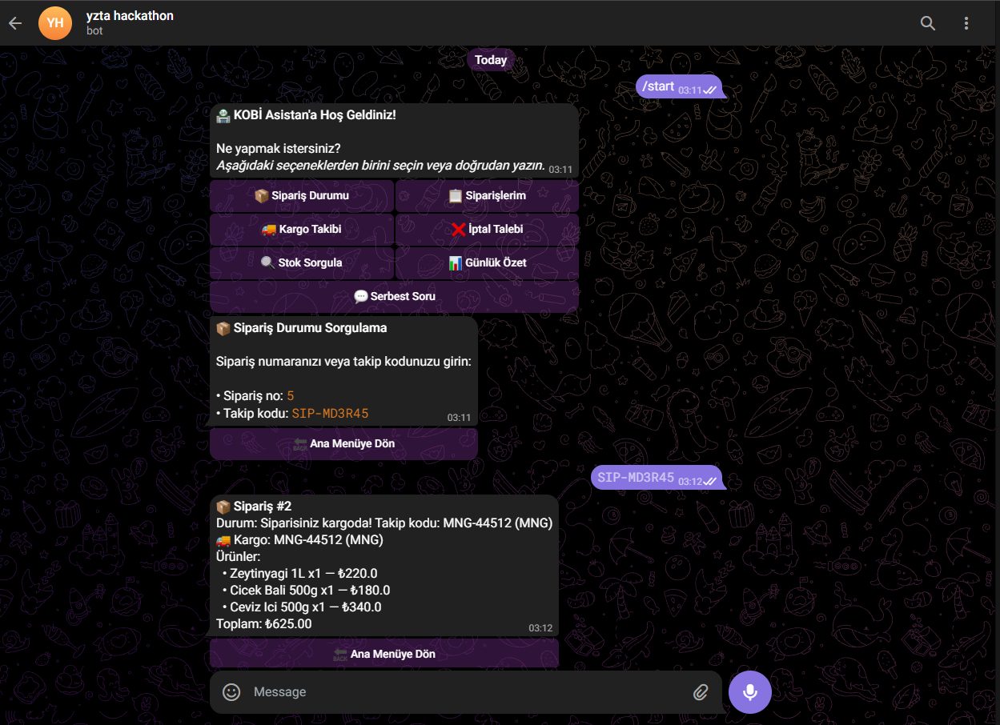
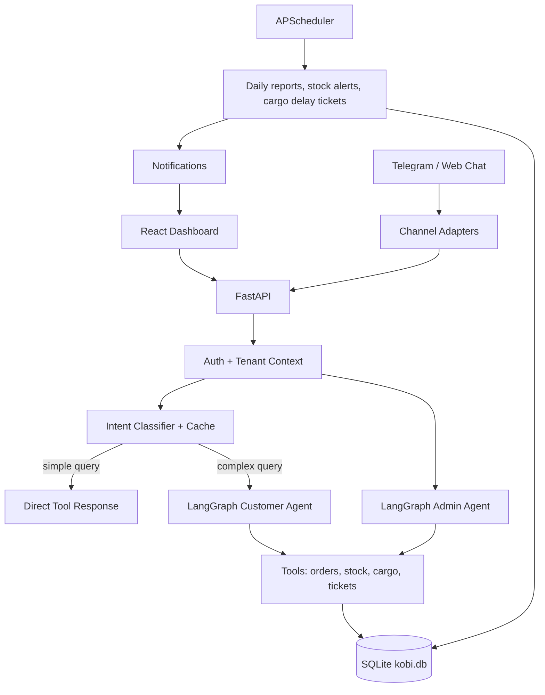

# KOBI Asistan

> v4.4 - Tenant-aware AI operations platform for small businesses.
> FastAPI + LangGraph + React Dashboard + Telegram + SQLite.

KOBI Asistan, kucuk isletmelerin siparis, stok, kargo, musteri iletisim ve insan onayi gerektiren operasyonlarini tek bir AI destekli akis altinda toplar. Hedef klasik bir yonetim paneli degil: isletmeci uygulamaya girdiginde "isimin buyuk kismi sistem tarafindan takip ediliyor, ben sadece kritik kararlara bakiyorum" hissini almalidir.

## Guncel Durum

Bu branch'te proje artik dort ana katmanda calisiyor:

- **Guided Dashboard**: Minimal React arayuzu, dark/light mode, Framer Motion gecisleri, gunluk ozet akisi, AI onerilen aksiyonlar, bildirimler ve admin AI asistan.
- **Tenant-aware Agent Core**: Her isletme icin `tenants/{tenant_id}/config.yaml` ile personality, rules, branding, feature flag ve LLM ayarlari.
- **Customer Automation**: Telegram/Web chat, prompt police, musteri auth scope, regex intent classifier, cache ve LangGraph agent.
- **Operations Automation**: Stok hareketleri, siparis/kargo takibi, ticket sistemi, AI raporlar, scheduler ve yonetici bildirimleri.

## Ekran Goruntuleri

Mevcut demo ekranlari `docs/screenshots/` altindadir. Yeni guided dashboard tasarimi daha sade bir akisa tasindi; eski ekranlar hala ozellik kapsamini gostermek icin tutuluyor.








## Mimari



### Tenant-aware yapi

`https://github.com/yerdaulet-damir/langgraph-sales-agent` reposu localde `C:\tmp\langgraph-sales-agent` altina clone edilip incelendi; repo proje icine eklenmedi ve git'e alinmadi. Oradan tam fork yerine su parcalar secilerek uyarlandi:

- YAML tabanli tenant config fikri.
- Agent state icinde `tenant_id`, `channel`, `channel_user_id`.
- Tenant-specific personality + rules prompt injection.
- Channel adapter pattern.
- Graph runtime config ile tenant gecirme yaklasimi.

Bizdeki karsiliklar:

- `tenants/default/config.yaml`
- `agent/tenant_config.py`
- `agent/tenant_context.py`
- `agent/state.py`
- `integrations/channels/base.py`
- `integrations/channels/telegram_adapter.py`
- `agent/graph.py`
- `agent/admin_graph.py`

## Ozellikler

### Dashboard

- JWT tabanli admin login (`/auth/login`, `/auth/me`).
- Protected React routes.
- Minimal guided overview:
  - Hos geldiniz ekrani.
  - Bugunun satis/ciro ozeti.
  - Hazirlanmasi gereken siparisler.
  - Onay bekleyen iptal ve riskli siparisler.
  - AI onerilen aksiyonlar.
- Dark/light mode.
- Bildirim zili ve in-app notification listesi.
- Admin AI Asistan sayfasi.
- Siparis, stok, kargo, ticket ve rapor sayfalari.

Varsayilan demo kullanici:

```text
username: admin
password: admin123
```

Admin kullaniciyi olusturmak icin:

```bash
python database/seed_users.py
```

### Customer chat / Telegram

- Telegram bot icin menu ve button tabanli akis.
- Channel adapter altyapisi: Telegram bugun, WhatsApp Business gelecekte ayni pattern ile eklenecek.
- Rate limiting.
- Prompt police.
- Telefon veya takip kodu ile musteri scope dogrulama.
- Basit sorgular icin LLM bypass:
  - siparis sorgu
  - kargo takip
  - stok sorgu
  - gunluk ozet
  - kritik stok
- Iptal, sikayet, ozel talep gibi durumlarda LangGraph agent calisir ve human review ticket acabilir.

### Admin AI Assistant

Isletmeci dashboard icinden dogal dil ile operasyon yaptirabilir:

- "Ceviz ici 500 gramdan 12 tane stok ekle"
- "Hazirlanan siparisleri kargoya al"
- "Kritik stoklari listele"
- "Bu urun icin stok hareketlerini goster"
- "Bu bileti cozuldu yap"

Admin tool katmani:

- `admin_stok_guncelle`
- `admin_toplu_stok_guncelle`
- `admin_siparis_guncelle`
- `admin_toplu_siparis_guncelle`
- `admin_urun_ekle`
- `admin_bilet_guncelle`

Stok tool'lari urun adinda esnek arama yapar ve her degisiklik `stock_movements` tablosuna loglanir.

### Ticket ve bildirimler

- Human-in-the-loop ticket sistemi.
- Kargo gecikmesi, kritik stok, iptal talebi ve manuel inceleme biletleri.
- Kritik ticket olustugunda dashboard bildirimi.
- Telegram yonetici bildirimi icin notifier altyapisi.
- AI raporlar artik acik ticketlari ve cozulmesi gereken sorunlari da icerir.

### Scheduler

- Sabah raporu: gunluk KPI + acik ticketlar + aksiyon onerileri.
- Kritik stok taramasi: urun basina gunluk dedupe ile ticket.
- Kargo gecikme taramasi: siparis basina gunluk dedupe ile ticket.
- Kargo gecikme musteri mesajlari template ile uretilir; LLM sadece yuksek degerli analizlerde kullanilir.

## LLM Kullanim Politikasi

| Senaryo | LLM | Not |
|---|---:|---|
| Basit siparis/stok/kargo sorgusu | Hayir | Regex intent classifier + direkt tool |
| Tekrarlayan cevaplar | Hayir | Template/cache |
| Iptal, sikayet, ozel talep | Evet | Agent + ticket |
| Kritik stok tedarikci taslagi | Evet | Dusuk frekans, yuksek deger |
| Gunluk isletme raporu | Evet | Scheduler veya dashboard |
| AI task onerileri | Evet | JSON cikti + fallback template |

## Kurulum ve Calistirma

Backend:

```bash
cd D:\projects\kobi_asistan
python -m venv venv
venv\Scripts\activate
pip install -r requirements.txt
python database/seed.py
python database/seed_users.py
uvicorn main:app --reload --port 8000
```

Dashboard:

```bash
cd D:\projects\kobi_asistan\dashboard
npm install
npm run dev
```

Dashboard adresi:

```text
http://localhost:5173
```

Backend adresi:

```text
http://localhost:8000
```

Dashboard Vite proxy backend'i `localhost:8000` uzerinden bekler. `ECONNREFUSED /dashboard/stats` hatasi genelde FastAPI calismadiginda gorulur.

### Ortam degiskenleri

```env
LLM_PROVIDER=ollama
OLLAMA_MODEL=qwen2.5:7b
OLLAMA_BASE_URL=http://localhost:11434

# Alternatifler
# LLM_PROVIDER=openai
# OPENAI_API_KEY=...
# OPENAI_MODEL=gpt-4o-mini

# LLM_PROVIDER=anthropic
# ANTHROPIC_API_KEY=...

# LLM_PROVIDER=gemini
# GEMINI_API_KEY=...

TELEGRAM_ENABLED=false
TELEGRAM_BOT_TOKEN=
TELEGRAM_ADMIN_CHAT_ID=

JWT_SECRET_KEY=change-me
JWT_ALGORITHM=HS256
ACCESS_TOKEN_EXPIRE_MINUTES=1440
```

## API Ozeti

| Method | Endpoint | Aciklama |
|---|---|---|
| POST | `/auth/login` | Admin login |
| GET | `/auth/me` | Aktif admin |
| POST | `/api/v1/chat` | Musteri chat |
| POST | `/api/v1/chat/stream` | Musteri chat SSE |
| POST | `/api/v1/admin/chat` | Admin AI assistant |
| GET | `/api/v1/notifications` | Dashboard bildirimleri |
| PATCH | `/api/v1/notifications/{id}/read` | Bildirim okundu |
| GET | `/dashboard/stats` | KPI ve dashboard ozet |
| GET | `/dashboard/sales-chart` | Satis trendi |
| GET | `/dashboard/analytics` | Urun/musteri/risk analitigi |
| GET | `/dashboard/ai-tasks` | AI task onerileri |
| GET | `/dashboard/cargo` | Kargo operasyon gorunumu |
| GET/POST | `/tickets/` | Ticket liste/olustur |
| PATCH | `/tickets/{id}/status` | Ticket durum guncelle |
| GET/POST | `/reports/` | Rapor listeleme/uretme |
| GET/PATCH | `/products/` | Urun ve stok yonetimi |
| GET/PATCH | `/orders/` | Siparis yonetimi |

## Proje Yapisi

```text
kobi_asistan/
|-- main.py
|-- config.py
|-- agent/
|   |-- graph.py
|   |-- admin_graph.py
|   |-- state.py
|   |-- tenant_config.py
|   |-- tenant_context.py
|   |-- intent_classifier.py
|   |-- llm_service.py
|   |-- scheduler.py
|   |-- auth.py
|   `-- guard.py
|-- tools/
|   |-- order_product_tools.py
|   |-- admin_tools.py
|   `-- kargo_tools.py
|-- routers/
|   |-- auth_router.py
|   |-- chat.py
|   |-- admin_chat.py
|   |-- dashboard.py
|   |-- tickets.py
|   |-- reports.py
|   |-- orders.py
|   `-- products.py
|-- database/
|   |-- db.py
|   |-- schemas.py
|   |-- seed.py
|   `-- seed_users.py
|-- integrations/
|   |-- notifier.py
|   |-- telegram_bot.py
|   `-- channels/
|-- tenants/
|   `-- default/
|       `-- config.yaml
|-- dashboard/
|   `-- src/
|       |-- context/AuthContext.jsx
|       |-- pages/Login.jsx
|       |-- pages/Overview.jsx
|       |-- pages/AdminAssistant.jsx
|       `-- ...
`-- docs/
    |-- revive.md
    |-- hackhaton_yarisma_tanimi.txt
    `-- screenshots/
```

## Veritabani

SQLite `kobi.db` icinde temel tablolar:

- `products`
- `orders`
- `order_items`
- `cargo_tracking`
- `tickets`
- `daily_reports`
- `stock_movements`
- `users`
- `notifications`

Kritik operasyon tablolarinda `tenant_id` alani eklenmistir. Bu su an tek tenant demo icin `default`/`1` olarak kullaniliyor; bir sonraki adim tenant switch ve tenant CRUD.

## Oncelik Sirasi

### 1. Auth guclendirme

Admin JWT login var. Musteri tarafinda telefon/takip kodu scope dogrulamasi var. Ancak siparis iptali gibi geri donusu zor aksiyonlar icin OTP zorunlu hale getirilmeli:

- Siparisteki gercek kisiye Telegram/WhatsApp/SMS/e-posta OTP.
- OTP dogrulanmadan iptal ticket'i acilmamali.
- OTP denemeleri rate limitlenmeli.
- Kritik aksiyon audit log'a yazilmali.

### 2. Gercek multi-tenant tamamlanmasi

- Tenant switch UI.
- Tenant create/update API.
- Tenant bazli kullanici yetkileri.
- Tenant bazli data isolation testleri.
- `tenants/{tenant_id}/config.yaml` ile DB kayitlari arasinda net sozlesme.

### 3. WhatsApp Business adapter

- Telegram adapter pattern'i WhatsApp Business icin genislet.
- Kritik ticket olusunca direkt ilgili chate yonetici bildirimi.
- Musteri iptal/iadede OTP ve human review akisini WhatsApp thread'i uzerinden yurut.

### 4. Repository pattern ve tool ayrimi

Dis repodan ilham alinan repository pattern su an henuz tam uygulanmadi. Siradaki temizlik:

- `repositories/base.py`
- `repositories/orders.py`
- `repositories/products.py`
- `repositories/tickets.py`
- Tool'lari domain bazli kucuk dosyalara bolme.

### 5. FAQ / RAG

- Iade kosullari, kargo sureleri, odeme, garanti gibi sik sorular icin statik fallback.
- Sonra ChromaDB veya hafif embedding store.
- Basit FAQ cevaplari LLM'siz donmeli.

### 6. Tedarikci e-posta ve export

- Stok ticket'inda uretilen e-posta taslagini SMTP ile gonderme.
- PDF/Excel rapor export.
- Haftalik/aylik analitik rapor.

### 7. Production hardening

- httpOnly cookie auth.
- PostgreSQL migration.
- Alembic migration sistemi.
- LangSmith tracing.
- Centralized logging.
- Deployment dokumantasyonu.

## Test / Dogrulama Notlari

Bu branch'te daha once su kontroller yapildi:

- FastAPI `/dashboard/stats` calisti.
- Intent classifier basit siparis/stok sorgularinda LLM bypass etti.
- React dashboard build ve browser smoke testleri calisti.
- Guided dashboard login ve ana akis kontrol edildi.

Yeni kurulumda once backend'i `uvicorn main:app --reload --port 8000` ile ayaga kaldirin; sonra dashboard'u `npm run dev` ile calistirin.
