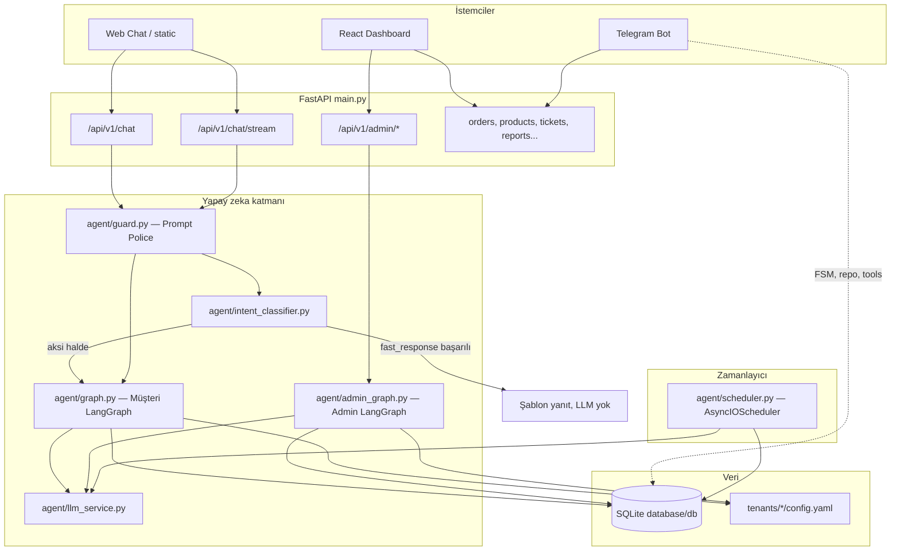
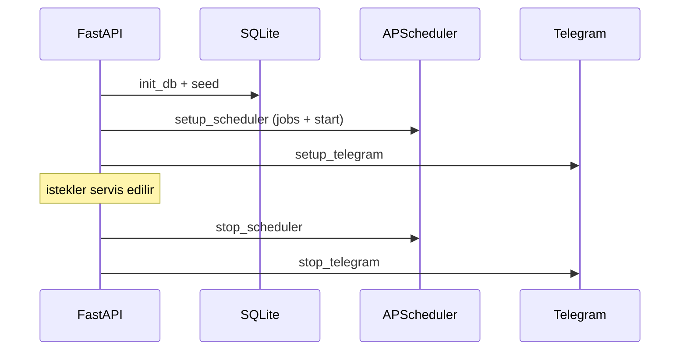
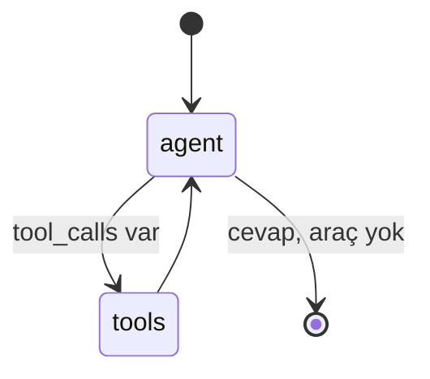
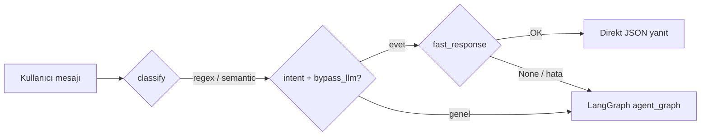
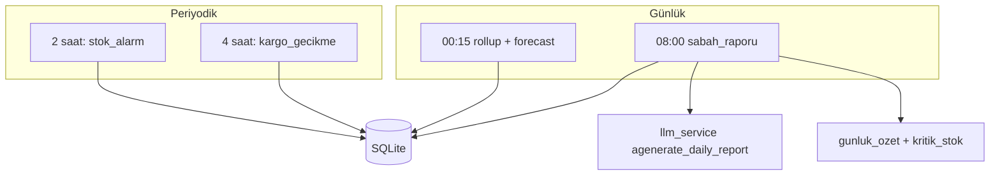
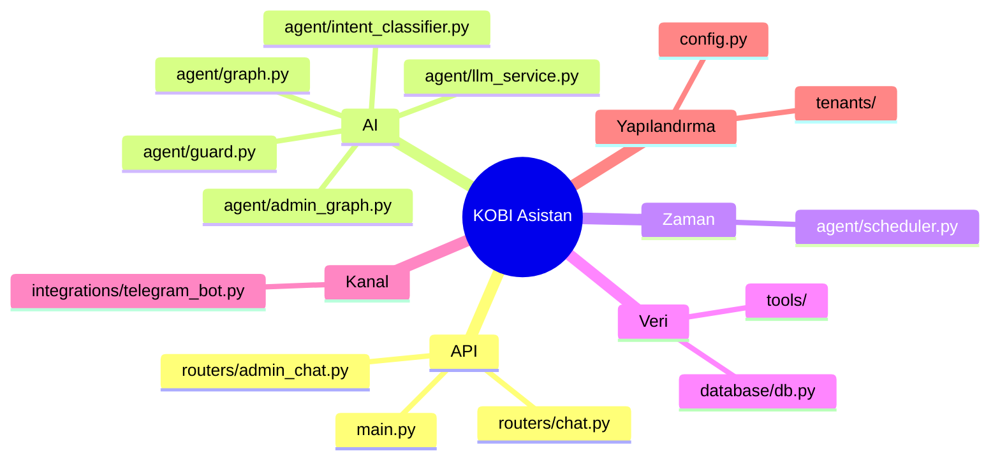

# KOBI Asistan — Teknik Mimari Raporu

Bu belge, **YZTA Hackathon** projesinin çalışma biçimini; **LangGraph** tabanlı ajanlar, **intent classifier** (hızlı yol / LLM bypass), **APScheduler** zamanlanmış görevleri, güvenlik katmanları ve kanal entegrasyonlarını özetler. Kod referansları repo köküne göredir.

---

## 1. Yönetici özeti

Uygulama **FastAPI** üzerinde çalışır. Müşteri sohbeti için **LangGraph** ile tanımlanmış, **araç çağrılı (tool-calling)** tekrarlayan bir graf kullanılır; basit ve öngörülebilir sorgularda **regex + isteğe bağlı anlamsal sınıflandırıcı** devreye girerek **LLM maliyeti ve gecikmesi düşürülür**. İşletmeci paneli için ayrı bir **admin LangGraph** grafiği ve onay token’lı yönetim araçları vardır. **APScheduler** (`AsyncIOScheduler`) ile günlük rollup, sabah raporu (LLM), kritik stok ve kargo gecikmesi müdahaleleri periyodik çalıştırılır. **Telegram** tarafı çoğunlukla **FSM + doğrudan repository/tool** ile yönetilir; web chat ile aynı LangGraph grafiğini çağırmaz.

---

## 2. Sistem genel görünümü

---

## 3. Uygulama yaşam döngüsü (startup / shutdown)

`main.py` içinde `lifespan` bağlamı:

1. **Veritabanı:** `init_db()`, seed script’leri.
2. **APScheduler:** `setup_scheduler()` — cron ve interval işleri kaydedilir ve `start()` çağrılır.
3. **Telegram:** `setup_telegram()` (async).

Kapanışta scheduler ve Telegram düzgün durdurulur.

---

## 4. LangGraph — Müşteri ajanı (`agent/graph.py`)

### 4.1 Durum (state)

`KobiAgentState` (`agent/state.py`):

- `messages`: LangGraph’in `add_messages` reducer’ı ile biriken sohbet mesajları.
- `tenant_id`, `channel`, `channel_user_id`: çok kiracılı ve kanal bağlamı için taşınan alanlar.

### 4.2 Graf topolojisi

Graf **iki düğüm** ve **koşullu kenar** ile klasik ReAct döngüsünü uygular:

| Düğüm   | Görev |
|---------|--------|
| `agent` | Tenant YAML + auth durumuna göre sistem mesajı üretir; LLM’i `bind_tools(ALL_TOOLS)` ile çağırır. |
| `tools` | `ToolNode(ALL_TOOLS)` — modelin seçtiği araçları sırayla çalıştırır. |

Kenarlar:

- `START` → `agent`
- `agent` → `tools_condition` → ya `tools` ya da graf sonu (model araç çağırmıyorsa).
- `tools` → `agent` (sonuçları modele geri verir).

### 4.3 Checkpoint

`graph.compile(checkpointer=MemorySaver())` — **bellek içi** thread checkpoint’i. `thread_id` olarak web oturumunda `session_id` kullanılır; konuşma kısa süreli bağlam için uygundur, kalıcı PostgreSQL checkpoint değildir.

### 4.4 Çalışma zamanı bağlamı

`agent_node` içinde:

- `_runtime_context`: `set_tenant_id`, `set_channel_context` ile tenant ve kanal bilgisi runtime’a işlenir.
- `get_active_scope()` (`agent/auth.py`): telefon veya `SIP-XXXXXX` takip kodu ile **müşteri yetkisi**; doğrulanmışsa `SYSTEM_PROMPT_AUTHENTICATED` kullanılır.

### 4.5 LLM sağlayıcı seçimi

`_create_llm`: önce `settings.LLM_PROVIDER` normalize edilir; hosted sağlayıcı (OpenAI, Anthropic, Gemini) seçiliyse tenant YAML’daki varsayılan Ollama yerine **ortam yapılandırması öncelikli** davranır. Araç bağlama: `.bind_tools(ALL_TOOLS)`.

**Müşteri araçları** (özet): sipariş sorgulama, müşteri sipariş listesi, stok, kritik stok, günlük özet, kargo takip, bilet oluşturma, iptal OTP akışı.

---

## 5. LangGraph — Admin ajanı (`agent/admin_graph.py`)

Admin grafiği yapı olarak müşteri ile aynıdır (`StateGraph` + `ToolNode` + `tools_condition`), fakat:

- State tipi: LangGraph’in `MessagesState`’i (sadece mesaj listesi; tenant `get_tenant_id()` ile okunur).
- Sistem prompt’u: işletmeciye özel **onay zorunluluğu** — DB yazan işlemler doğrudan değil, `*_onay_iste` araçları ve `admin_pending_uygula` ile token onayı üzerinden yapılır.
- Araç seti: `ALL_ADMIN_TOOLS` — ortak operasyon araçları + `tools/admin_tools.py` içindeki yönetim araçları.

Dashboard’daki admin sohbet uç noktası (`routers/admin_chat.py`) bu grafiği `invoke` / stream ile kullanır; JWT ile `get_current_user` doğrulaması yapılır.

---

## 6. Intent classifier (`agent/intent_classifier.py`)

Amaç: **Basit, yapılandırılmış niyetlerde** doğrudan ilgili **LangChain tool**’unu çağırıp şablonla cevap üretmek (`bypass_llm=True`) — tahmini olarak çok sayıda rutin sorguda LLM maliyetini düşürür.

### 6.1 Tespit sırası

1. **Regex tabanlı `INTENTS` sözlüğü** — Türkçe/İngilizce kalıplar; eşleşme halinde `IntentResult` (intent, params, confidence, `bypass_llm`).
2. Eşleşme yoksa **`_semantic_intent`**:
   - Ortamda `USE_EMBEDDING_CLASSIFIER=true` ise `sentence-transformers` (paraphrase-multilingual-MiniLM-L12-v2) ile örnek cümle embedding’leri; kosinüs benzerliği ≥ **0.68**.
   - Aksi halde veya hata durumunda **difflib.SequenceMatcher** ile `SEMANTIC_EXAMPLES` üzerinden eşik ≥ **0.72**.

### 6.2 `bypass_llm` kuralları (özet)

- `siparis_sorgula`: referans (sipariş no / takip kodu) çıkarılabildiyse bypass.
- `musteri_siparisleri`: aktif scope’ta telefon veya takip kodu varsa bypass.
- `stok_sorgu`: ürün adı çıkarıldıysa bypass.
- `kritik_stok`, `gunluk_ozet`: parametresiz bypass.
- `kargo_takip`, `iptal_talebi`: bypass **kapalı** veya kısıtlı — zincir / bilet mantığı LLM veya tam akışa bırakılır.

### 6.3 Hızlı yol: `fast_response`

`classify` sonrası `bypass_llm` ve `fast_response` başarılıysa `routers/chat.py` **LangGraph’i atlar** ve doğrudan `ChatResponse` döner.

- **Önbellek:** MD5 anahtar (intent + params + scope); TTL **300 sn**; başarılı yanıtlar (❌ ile başlamayan) cache’lenir.

### 6.4 `/chat` vs `/chat/stream`

- **`POST /api/v1/chat`:** Prompt police → auth → **classify + fast path** → gerekirse LangGraph `invoke`.
- **`POST /api/v1/chat/stream`:** Prompt police → auth → **doğrudan** `agent_graph.stream` (SSE). Bu uç noktada **intent classifier bypass yolu uygulanmaz**; tam akış her zaman graf üzerinden akar.

---

## 7. Güvenlik: Prompt Police (`agent/guard.py`)

`check_message` üç aşamalı:

1. **Injection / SQL benzeri** regex kalıpları.
2. **Yasaklı konu** kalıpları (şifre, exploit, rastgele kod üretimi vb.).
3. Uzun mesajlarda **whitelist anahtar kelime** (sipariş, stok, kargo, selam vb.); çok kısa mesajlar serbest geçer.

Başarısızlıkta LLM ve classifier’a gelinmeden reddedilir.

---

## 8. APScheduler (`agent/scheduler.py`)

`AsyncIOScheduler` örneği modül seviyesinde `scheduler` olarak tutulur. `setup_scheduler()` aşağıdaki işleri ekler:

| Job ID | Tetikleyici | İşlev |
|--------|-------------|--------|
| `rollup_metrics` | Cron **00:15** | `rollup_yesterday_all_tenants`, `refresh_forecasts_all_tenants` |
| `sabah_raporu` | Cron **08:00** | Tenant başına: `gunluk_ozet`, `kritik_stok_listesi`, DB’den kargo gecikmeleri ve açık biletler → `agenerate_ai_tasks` (opsiyonel) → `agenerate_daily_report` → `daily_reports` tablosuna yazım |
| `stok_alarm` | **Her 2 saat** | Kritik stok için `ensure_stock_alert_ticket` |
| `kargo_gecikme` | **Her 4 saat** | Kargodaki siparişlerde `kargo_takip`; gecikme statülerinde `create_cargo_delay_ticket_for_order` |

Bildirimler: `_add_notification` ile bellek içi `notification_queue` (max 50); konsola log. Kalıcı bildirim store’u için `integrations/notifier` ile entegrasyon API tarafında kullanılabilir.

**Not:** Sabah raporu LLM’i `agent/llm_service.py` içindeki `_create_llm` ile `settings.LLM_PROVIDER` üzerinden seçilir; LangGraph grafiğinden bağımsız bir **tek seferlik metin üretimi**dir.

---

## 9. Tenant yapılandırması (`agent/tenant_config.py`)

`tenants/<slug>/config.yaml` (ve basit YAML parser fallback) ile işletme adı, asistan kişiliği, kurallar, **LLM provider/model/sıcaklık**, branding ve özellik bayrakları yüklenir. Müşteri `agent_node` içinde `tenant_prompt_block(tenant_id)` ile sistem prompt’una eklenir.

---

## 10. Telegram (`integrations/telegram_bot.py`)

- **Rate limit:** kullanıcı başına dakika ve saatlik istek sınırları.
- **Durum makinesi (FSM):** menü, sipariş akışı, iptal adımları vb. `user_data["state"]` ile.
- **Doğrulama:** `validate_phone` / `validate_tracking_code` ile web ile uyumlu scope.
- **LangGraph:** Bu modülde `agent_graph` kullanımı yok; sipariş takip gibi işlemler doğrudan tool veya repository çağrılarıyla yapılır.

---

## 11. Teknoloji yığını (özet)

| Bileşen | Kütüphane / dosya |
|---------|-------------------|
| API | FastAPI (`main.py`) |
| Müşteri ajan grafiği | `langgraph` StateGraph, ToolNode, `langgraph.prebuilt.tools_condition` |
| Admin ajan grafiği | Aynı desen, `agent/admin_graph.py` |
| LLM birleştirme | `langchain-openai`, `langchain-anthropic`, `langchain-google-genai`, `langchain-ollama` |
| Zamanlayıcı | `apscheduler` AsyncIOScheduler, CronTrigger, IntervalTrigger |
| Sınıflandırıcı | `re`, `difflib`; isteğe bağlı `sentence-transformers` |
| Veri | SQLite, `database/` |

---

## 12. Bilinen tasarım notları

- **MemorySaver:** süreç yeniden başlarsa thread hafızası sıfırlanır; üretimde Postgres checkpointer düşünülebilir.
- **Session scope:** `auth.py` içinde global sözlük + `ContextVar`; çok ölçekli dağıtık ortamda harici oturum store gerekir.
- **SQLite eşzamanlılık:** APScheduler ve API aynı anda yazıyorsa yoğun yükte WAL / connection stratejisi gözden geçirilebilir (iç dokümantasyonda da geçer).

---

## 13. Dosya — sorumluluk eşlemesi

---

*Belge, repo içi kaynak kodunun 2026 itibarıyla okunmasıyla üretilmiştir; davranış değişikliklerinde güncellenmelidir.*
